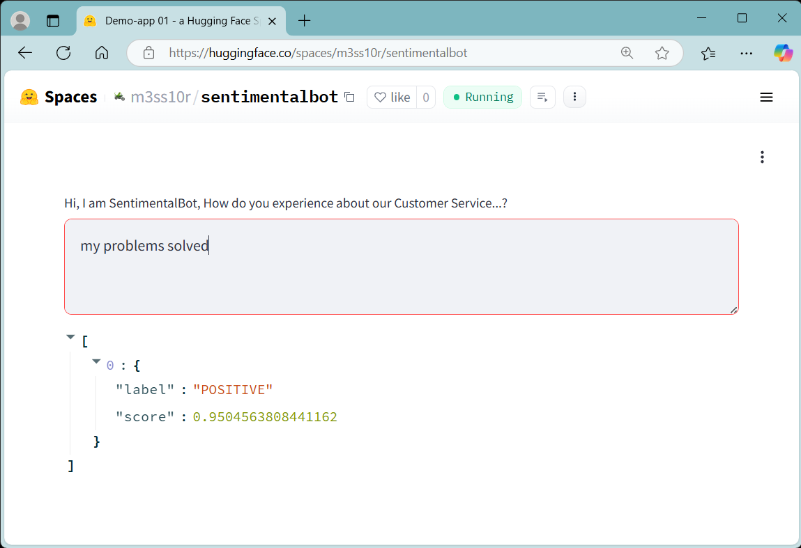
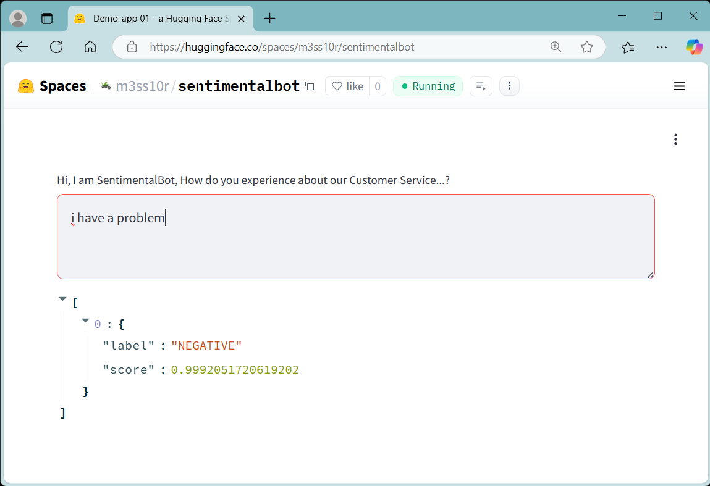
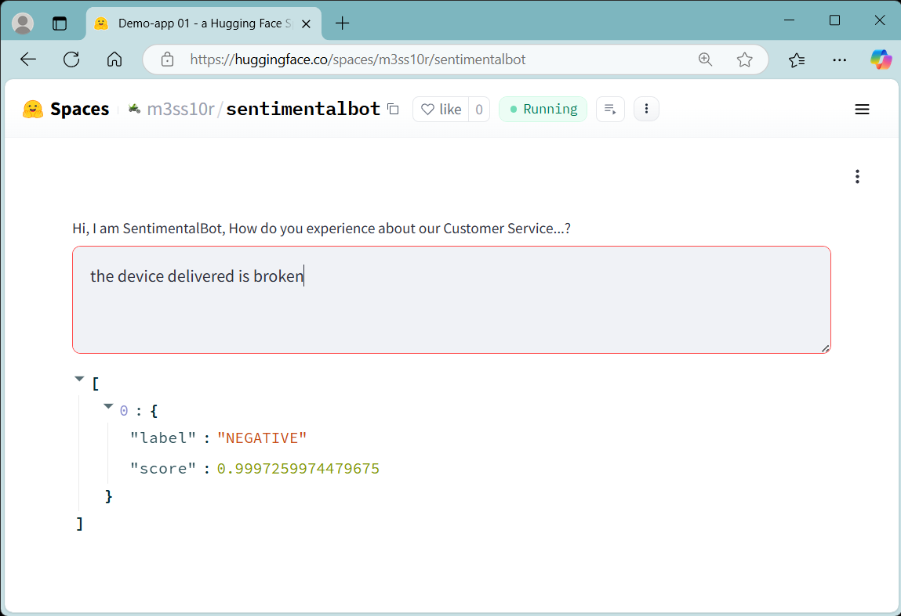

# SentimentalBot

Customer Service or Experience Sentiment Analysis Bot

## Objective

To deploy a chatbot for customer service that can identify whether the sentiment expressed is positive or negative.
Sentiment analysis is a natural language processing (NLP) technique used to determine the emotional tone behind a piece of text.

## Features

- **Model**: Hugging Face - distilbert-base-uncased-finetuned-sst-2-english (sentiment analysis).
- **SDK**: streamlit, torch, transformer.

## Getting Started

To get started with sentiment analysis, follow these steps:

[Get Start](https://huggingface.co/spaces/m3ss10r/sentimentalbot)

## *Author*
Mior
